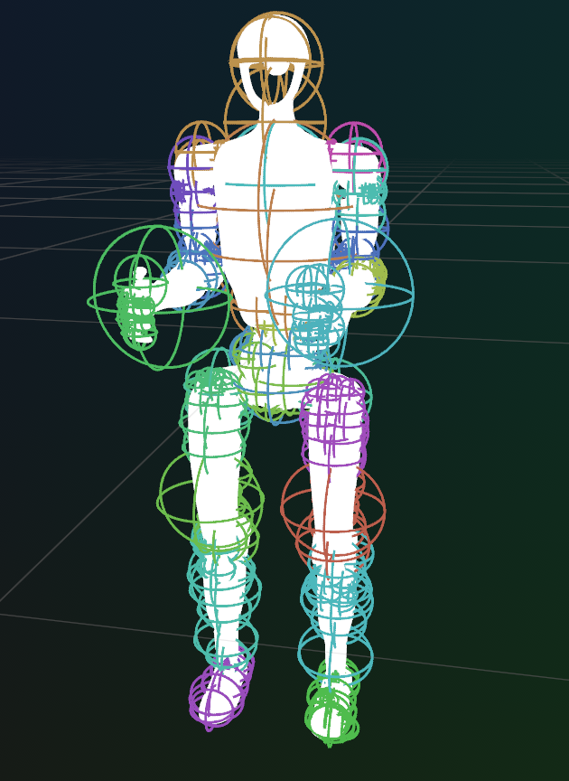

urdf-spherizer
==============

Convert URDF visual geometry into conservative sphere-based collision geometry.

Usage
-----

```bash
uvx urdf-spherizer path/to/model.urdf -o path/to/model.spheres.urdf --max-spheres 16
```

Optional visualization with rerun:

```bash
uvx urdf-spherizer path/to/model.urdf --viz
```

If your URDF uses `package://` URLs, pass package roots:

```bash
uvx urdf-spherizer path/to/model.urdf --package-dir my_robot=/path/to/my_robot
```


Results
--------


